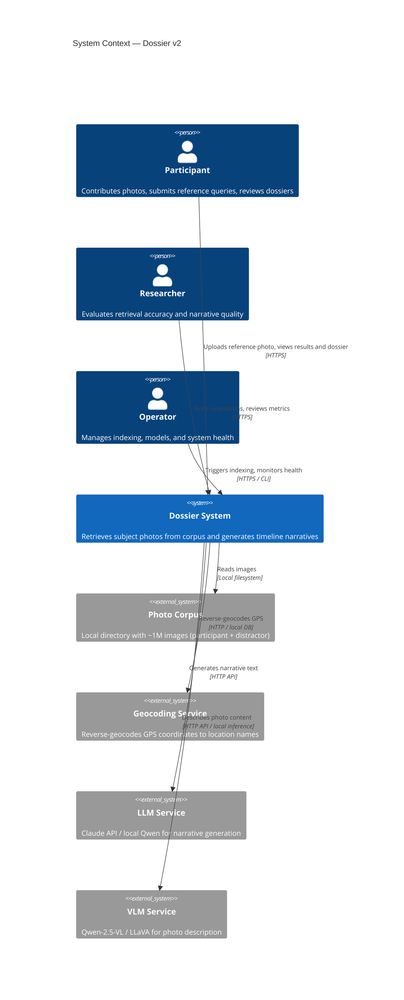
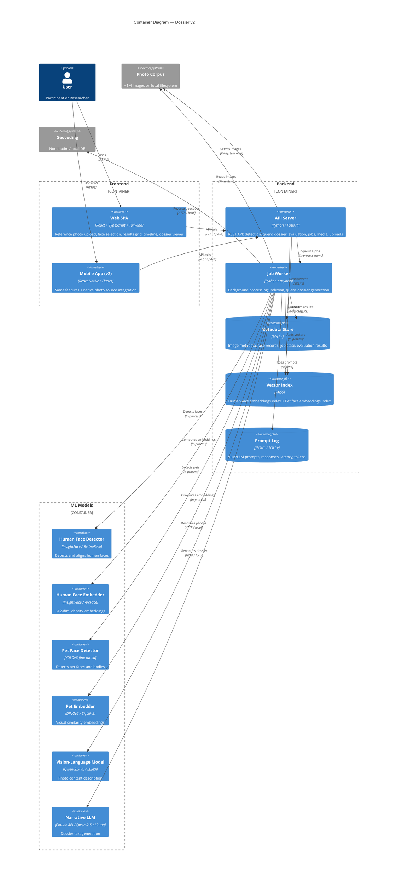

# Architecture Overview — Dossier v2: The Needle in a Haystack

**Version**: 1.0
**Date**: 2026-03-06
**Status**: Draft
**Requirements**: `docs/requirements/project_requirements_v2.md`, `docs/requirements/common_requirements.md`

---

## 1. System Purpose and Context

Dossier is a retrieval-augmented generation (RAG) system for photo forensics. Given a single reference photo of a human or pet, it searches a corpus of ~1M images, retrieves all photos of that subject, and generates a coherent multi-day timeline narrative ("dossier") describing the subject's activities.

### Business Goals

| Goal | Success Metric |
|------|---------------|
| Accurate face retrieval (human) | Precision >= 90%, Recall >= 80% |
| Accurate face retrieval (pet) | Precision >= 80%, Recall >= 70% |
| Coherent narrative generation | >= 75% of timeline events judged "mostly accurate" by participants |
| Interactive retrieval speed | Results within seconds for single query |
| Corpus scale | Handle ~1M images without performance degradation |

### Target Users

- **Participants**: Contribute geocoded, timestamped photos documenting their daily life and pets. Use the system to verify retrieval accuracy against their own ground truth.
- **Researchers**: Evaluate RAG architecture performance on real-world face retrieval tasks.
- **Operators**: Manage corpus indexing, model updates, and system health.

---

## 2. Architectural Drivers

### Key Constraints

| Constraint | Rationale |
|------------|-----------|
| API-first, frontend-agnostic | v1 = web SPA, v2 = mobile app. Same backend serves both. |
| Stateless backend | Mobile clients cannot rely on server-side sessions. JWT auth. |
| Local filesystem corpus | No network-mounted storage requirement. Configurable directory. |
| GPU required | Face detection, embedding, and VLM inference need GPU acceleration. |
| On-premise data | Participant photos never leave the deployment. No external identification APIs. |

### Quality Attribute Scenarios

| Attribute | Scenario | Target |
|-----------|----------|--------|
| Performance | User submits reference photo, receives retrieval results | < 5 seconds |
| Performance | Dossier generation for 10-photo single-day set | < 30 seconds |
| Scalability | Index and query against 1M+ image corpus | No degradation |
| Reliability | Indexing pipeline interrupted mid-run | Resume from checkpoint |
| Reliability | VLM/LLM call fails | Graceful fallback to metadata-only description |
| Security | Path traversal attempt on media endpoint | Blocked, logged |
| Security | Prompt injection in dossier generation | Isolated system prompt, output validation |
| Maintainability | Swap human face model (ArcFace -> different model) | Config change only |
| Maintainability | Add new subject type (e.g., vehicle) | Add detector + embedder, no core changes |

---

## 3. C4 Context Diagram



---

## 4. C4 Container Diagram



---

## 5. Component Diagram — Backend

```mermaid
C4Component
    title Component Diagram — Backend API Server

    Container_Boundary(api, "API Layer") {
        Component(detect_ep, "/detect", "FastAPI Router", "Face auto-detection on uploaded image")
        Component(query_ep, "/query", "FastAPI Router", "Submit retrieval query, get job ID or results")
        Component(dossier_ep, "/dossier", "FastAPI Router", "Generate/retrieve dossier narrative")
        Component(eval_ep, "/evaluate", "FastAPI Router", "Ground-truth evaluation")
        Component(jobs_ep, "/jobs", "FastAPI Router", "Job status polling and SSE streaming")
        Component(media_ep, "/media", "FastAPI Router", "Serve corpus images by path")
        Component(upload_ep, "/photos/upload", "FastAPI Router", "Photo upload (standard + resumable)")
        Component(stats_ep, "/index/stats", "FastAPI Router", "Index statistics")
        Component(health_ep, "/health", "FastAPI Router", "Liveness + readiness checks")
    }

    Container_Boundary(services, "Service Layer") {
        Component(detection_svc, "DetectionService", "Python", "Orchestrates human + pet face detection")
        Component(retrieval_svc, "RetrievalService", "Python", "Embeds query face, searches index, ranks results")
        Component(timeline_svc, "TimelineService", "Python", "Builds chronological timeline, groups by day, detects patterns")
        Component(narrative_svc, "NarrativeService", "Python", "VLM photo description + LLM dossier generation")
        Component(eval_svc, "EvaluationService", "Python", "Computes precision/recall/F1 against ground-truth")
        Component(job_svc, "JobService", "Python", "Manages async job lifecycle")
        Component(upload_svc, "UploadService", "Python", "Handles file upload, EXIF extraction, normalization")
    }

    Container_Boundary(domain, "Domain Layer") {
        Component(scanner, "CorpusScanner", "Python", "Recursive directory walker with format filtering")
        Component(exif, "MetadataExtractor", "Python", "EXIF parsing, GPS normalization")
        Component(geocoder, "Geocoder", "Python", "Reverse-geocode GPS with caching")
        Component(index_mgr, "IndexManager", "Python", "FAISS index CRUD, type-filtered search")
        Component(embeddings, "EmbeddingPipeline", "Python", "Unified detect -> embed pipeline for both types")
        Component(describer, "PhotoDescriber", "Python", "VLM-based photo description")
        Component(generator, "DossierGenerator", "Python", "LLM-based narrative generation")
    }

    Container_Boundary(infra, "Infrastructure") {
        Component(config, "Settings", "Pydantic", "Layered configuration singleton")
        Component(logger, "Logger", "structlog", "Structured logging with AI-specific fields")
        Component(errors, "AppError", "Python", "Consistent error handling with ErrorCode enum")
        Component(store, "MetadataStore", "SQLite", "Image and face metadata persistence")
    }

    Rel(detect_ep, detection_svc, "Calls")
    Rel(query_ep, retrieval_svc, "Calls")
    Rel(query_ep, job_svc, "Enqueues async")
    Rel(dossier_ep, narrative_svc, "Calls")
    Rel(dossier_ep, job_svc, "Enqueues async")
    Rel(eval_ep, eval_svc, "Calls")
    Rel(upload_ep, upload_svc, "Calls")

    Rel(detection_svc, embeddings, "Detects faces")
    Rel(retrieval_svc, embeddings, "Embeds query")
    Rel(retrieval_svc, index_mgr, "Searches")
    Rel(retrieval_svc, store, "Enriches with metadata")
    Rel(narrative_svc, timeline_svc, "Builds timeline")
    Rel(narrative_svc, describer, "Describes photos")
    Rel(narrative_svc, generator, "Generates dossier")
    Rel(eval_svc, retrieval_svc, "Runs queries")
    Rel(upload_svc, exif, "Extracts metadata")

    Rel(embeddings, store, "Writes face records")
    Rel(embeddings, index_mgr, "Adds embeddings")
    Rel(scanner, store, "Writes image records")
    Rel(scanner, exif, "Extracts metadata")
    Rel(exif, geocoder, "Geocodes GPS")
```



---

## 6. Data Flow

### 6.1 Indexing Pipeline (Batch)

```
Local Corpus Directory
        |
        v
  CorpusScanner ── scan recursively, filter by format
        |
        v
  MetadataExtractor ── extract EXIF (timestamp, GPS, camera)
        |
        v
  Geocoder ── reverse-geocode GPS to location names
        |
        v
  MetadataStore ── persist image + metadata records (SQLite)
        |
        v
  EmbeddingPipeline
    |                    |
    v                    v
  HumanDetector      PetDetector
    |                    |
    v                    v
  HumanEmbedder      PetEmbedder
    |                    |
    v                    v
  FAISS Index         FAISS Index
  (human)             (pet)
    |                    |
    v                    v
  MetadataStore ── persist face records with embedding IDs
```

### 6.2 Query Pipeline (Interactive)

```
Reference Photo (uploaded by user)
        |
        v
  POST /detect ── run human + pet detectors
        |
        v
  DetectionResponse ── bounding boxes, types, confidence
        |
        v
  User selects face in UI
        |
        v
  POST /query ── face crop + subject_type + threshold + top_k
        |
        v
  EmbeddingPipeline ── embed the selected face
        |
        v
  IndexManager ── type-filtered FAISS search
        |
        v
  MetadataStore ── enrich results with image metadata
        |
        v
  QueryResponse ── ranked matches with scores, metadata, image URLs
```

### 6.3 Dossier Generation Pipeline

```
QueryResponse (retrieval results)
        |
        v
  TimelineService
    ├── sort by timestamp
    ├── group by calendar day
    ├── cluster into scenes
    ├── detect cross-day patterns
    └── handle missing metadata
        |
        v
  PhotoDescriber (VLM)
    ├── describe each photo's visual content
    ├── include subject type context
    └── log prompt + response
        |
        v
  DossierGenerator (LLM)
    ├── input: ordered descriptions + timeline + patterns
    ├── generate executive summary
    ├── generate per-day narrative entries
    ├── generate cross-day analysis
    ├── adapt language for subject type (human vs. pet)
    └── include confidence notes
        |
        v
  Dossier (structured JSON)
    ├── executive_summary
    ├── date_range
    ├── days[] -> entries[] -> {time, location, description, image_url, confidence}
    ├── patterns[]
    └── confidence_notes
```

---

## 7. Key Architectural Decisions

### ADR-001: Separate FAISS Indices per Subject Type

**Decision**: Maintain separate FAISS indices for human and pet face embeddings.

**Alternatives considered**:
- Single index with type metadata filtering post-search
- Single index with embedding-space separation (type prefix)

**Rationale**: Human face embeddings (ArcFace, 512-dim) and pet embeddings (DINOv2, 768-dim) have different dimensionality and embedding spaces. Mixing them in a single index would require dimension alignment and produce meaningless cross-type similarity scores. Separate indices eliminate cross-contamination and allow independent model upgrades.

### ADR-002: API-First Architecture with Independent Frontends

**Decision**: Backend is a headless JSON API. Web SPA and mobile app are separate deployable artifacts.

**Alternatives considered**:
- Server-rendered UI (Streamlit, Jinja templates)
- Hybrid: server-rendered web + separate mobile API

**Rationale**: v2 requires a native mobile app consuming the same API. Server-rendered UI would require a second API layer for mobile. Strict separation ensures the backend never contains UI logic, making it trivially consumable by any client. OpenAPI schema serves as the contract for auto-generating typed clients.

### ADR-003: Async Job System for Long-Running Operations

**Decision**: Indexing, large-corpus queries, and dossier generation return a job ID immediately. Clients poll or stream for progress.

**Alternatives considered**:
- Synchronous endpoints with long timeouts
- WebSocket-only for all operations

**Rationale**: Mobile networks are unreliable; HTTP connections can drop during long operations. Async jobs decouple operation lifecycle from HTTP request lifecycle. SSE provides real-time progress without WebSocket complexity. Polling is the fallback for clients that don't support SSE.

### ADR-004: SQLite for Metadata Store

**Decision**: Use SQLite for image metadata, face records, and job state.

**Alternatives considered**:
- PostgreSQL
- JSON files (like current admin static mounts)

**Rationale**: SQLite is zero-configuration, embedded, and handles the read-heavy workload well. At ~1M images with ~2-3 faces each, the database is ~500MB — well within SQLite's comfort zone. No external database server simplifies deployment. If scaling beyond a single node is needed in v2, migrate to PostgreSQL.

### ADR-005: DINOv2 for Pet Embeddings (over ArcFace)

**Decision**: Use DINOv2 for pet face/body embeddings rather than adapting ArcFace.

**Alternatives considered**:
- Fine-tune ArcFace on pet faces
- Use CLIP/SigLIP-2 for both human and pet

**Rationale**: ArcFace is trained specifically on human faces and does not generalize to animal faces. DINOv2 produces strong visual similarity embeddings across species without fine-tuning. It handles pose variation, fur patterns, and partial occlusion well. Trade-off: DINOv2 embeddings are less identity-specific than ArcFace, which explains the lower accuracy targets for pets (70% recall vs. 80% for humans).

### ADR-006: Cursor-Based Pagination (over Offset-Based)

**Decision**: All paginated endpoints use cursor-based pagination.

**Alternatives considered**:
- Offset-based (LIMIT/OFFSET)
- Keyset pagination

**Rationale**: Cursor-based pagination is stable across insertions and deletions (unlike offset, where items shift). It supports infinite scroll on mobile without missing or duplicating items. Performance is consistent regardless of page depth (unlike OFFSET which degrades on deep pages).

---

## 8. Technology Mapping

| Component | Technology | Version | Purpose |
|-----------|-----------|---------|---------|
| API Server | FastAPI | >= 0.115 | REST API framework |
| Runtime | Python | >= 3.12 | Application runtime |
| Human Face Detection | InsightFace (RetinaFace) | latest | Face detection + alignment |
| Human Face Embedding | InsightFace (ArcFace) | latest | 512-dim identity embeddings |
| Pet Face Detection | Ultralytics YOLOv8 | >= 8.0 | Pet face/body detection |
| Pet Embedding | DINOv2 (via transformers) | latest | Visual similarity embeddings |
| Vector Index | FAISS | >= 1.7 | Nearest-neighbor search |
| Photo Description | Qwen-2.5-VL / LLaVA | latest | Vision-language model |
| Narrative Generation | Claude API / Qwen-2.5 | latest | Large language model |
| Metadata Store | SQLite | 3.x | Image and face metadata |
| EXIF Extraction | Pillow + piexif | latest | Image metadata parsing |
| Reverse Geocoding | geopy (Nominatim) | latest | GPS to location name |
| Web Frontend | React + Vite + Tailwind | React 18+ | Single-page application |
| Mobile App (v2) | React Native / Flutter | TBD | Native mobile client |
| Config | pydantic-settings | >= 2.7 | Layered configuration |
| Logging | structlog | >= 24.4 | Structured logging |
| Testing | pytest | >= 8.3 | Test framework |
| Linting | ruff | >= 0.8 | Linting + formatting |
| Type Checking | mypy | >= 1.13 | Static type analysis |
| Package Manager | uv | latest | Python dependency management |

---

## 9. Deployment Topology

### Development Environment

```
Developer Machine (GPU)
├── Backend (uvicorn --reload, port 8000)
│   ├── FastAPI app
│   ├── ML models (loaded in-process)
│   ├── FAISS indices (in-memory)
│   ├── SQLite DB (local file)
│   └── Prompt logs (local JSONL)
├── Web SPA (vite dev server, port 3000)
│   └── Proxies /api/* to backend:8000
└── Photo Corpus (local directory)
```

### Production Environment (Single Node)

```
Production Server (GPU)
├── Backend (uvicorn, 2-4 workers, port 8000)
│   ├── Gunicorn master + uvicorn workers
│   ├── ML models (shared memory)
│   ├── FAISS indices (memory-mapped)
│   ├── SQLite DB (WAL mode for concurrent reads)
│   └── Prompt logs (rotated JSONL)
├── Web SPA (served from CDN or nginx)
│   └── Static build artifacts
├── Reverse Proxy (nginx, port 443)
│   ├── TLS termination
│   ├── /api/* -> backend:8000
│   └── /* -> web SPA static files
└── Photo Corpus (local or mounted directory)
```

---

## 10. Security Boundaries

```
┌─────────────────────────────────────────────────────────┐
│ EXTERNAL (untrusted)                                    │
│   Web Browser / Mobile App                              │
│     ↓ HTTPS + JWT                                       │
├─────────────────────────────────────────────────────────┤
│ DMZ                                                     │
│   Reverse Proxy (nginx)                                 │
│     - TLS termination                                   │
│     - Rate limiting                                     │
│     - Request size limits                               │
│     ↓                                                   │
├─────────────────────────────────────────────────────────┤
│ APPLICATION (trusted)                                   │
│   FastAPI API Server                                    │
│     - JWT validation                                    │
│     - Input validation (file type, size, path traversal)│
│     - Admin auth (X-Admin-Secret)                       │
│     ↓                                                   │
│   ML Models + FAISS + SQLite                            │
│     - Read-only corpus access                           │
│     - Prompt injection isolation                        │
│     ↓                                                   │
├─────────────────────────────────────────────────────────┤
│ DATA (restricted)                                       │
│   Photo Corpus (read-only for app)                      │
│   SQLite DB (read-write for app)                        │
│   Prompt Logs (append-only, PII redacted)               │
│   FAISS Indices (read-write for indexing, read for query)│
└─────────────────────────────────────────────────────────┘
```

---

## 11. Validation / Open Issues

| Item | Status | Notes |
|------|--------|-------|
| Pet face detection model selection | Open | Need to evaluate YOLOv8 fine-tuned vs. general object detection + filtering. Accuracy TBD. |
| VLM deployment model | Open | Local inference (Qwen-2.5-VL) vs. API (Claude vision). Depends on GPU memory budget. |
| LLM deployment model | Open | Local (Qwen-2.5 / Llama) vs. API (Claude). Cost vs. latency vs. privacy trade-off. |
| Reverse geocoding at scale | Open | Nominatim rate limits may be insufficient for ~1M images. Consider local Nominatim instance or cached database. |
| HEIC support | Open | `pillow-heif` vs. `pyheif` vs. ImageMagick conversion. Need to test across platforms. |
| SQLite concurrent write performance | Low risk | WAL mode handles concurrent reads well. Writes are serialized but infrequent after indexing. |
| FAISS index size at 1M scale | Low risk | 512-dim * 1M vectors * 4 bytes = ~2GB. Fits in memory on modern servers. |
| Multi-worker model loading | Medium risk | Multiple uvicorn workers each loading GPU models. Need shared memory or single-worker-with-async pattern. |

---

## 12. Requirements Traceability

| Requirement | Architecture Component | Notes |
|-------------|----------------------|-------|
| Feature 1 (Ingestion) | CorpusScanner, MetadataExtractor, EmbeddingPipeline, IndexManager | Batch indexing pipeline |
| Feature 2 (Retrieval) | DetectionService, RetrievalService, IndexManager | /detect + /query endpoints |
| Feature 3 (Timeline) | TimelineService | Timeline builder + day grouping + pattern detection |
| Feature 4 (Dossier) | NarrativeService, PhotoDescriber, DossierGenerator | VLM + LLM pipeline |
| Feature 5 (Evaluation) | EvaluationService | /evaluate endpoints |
| Feature 6 (Web UI) | Web SPA (React) | Separate deployable |
| Feature 7 (Mobile) | Mobile App (v2) | Same API, native photo sources |
| API-first constraint | ADR-002 | Headless backend, independent frontends |
| Stateless backend | JWT auth, no sessions | Mobile-ready |
| Async jobs | JobService, /jobs endpoints | ADR-003 |
| Type-filtered search | Separate FAISS indices | ADR-001 |
| REQ-LOG-001..018 | structlog, PromptLog | Structured logging with AI fields |
| REQ-SEC-001..009 | Security boundaries, input validation | See Section 10 |
| REQ-ERR-001..007 | AppError, ErrorCode | Consistent error handling |
| REQ-CFG-001..009 | Settings singleton | Layered config |
