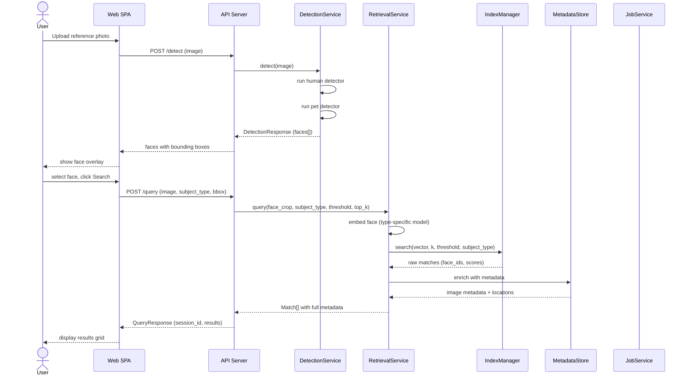
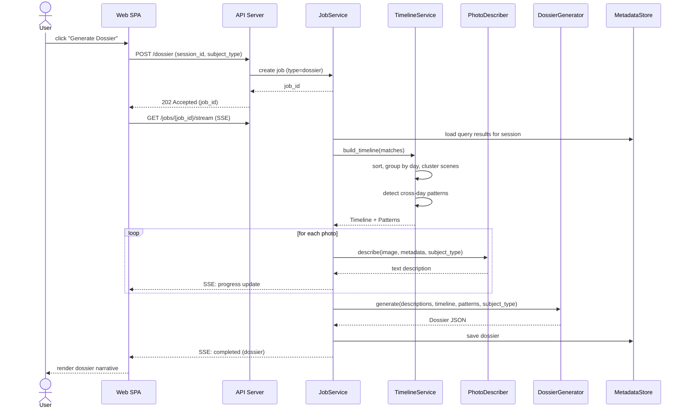
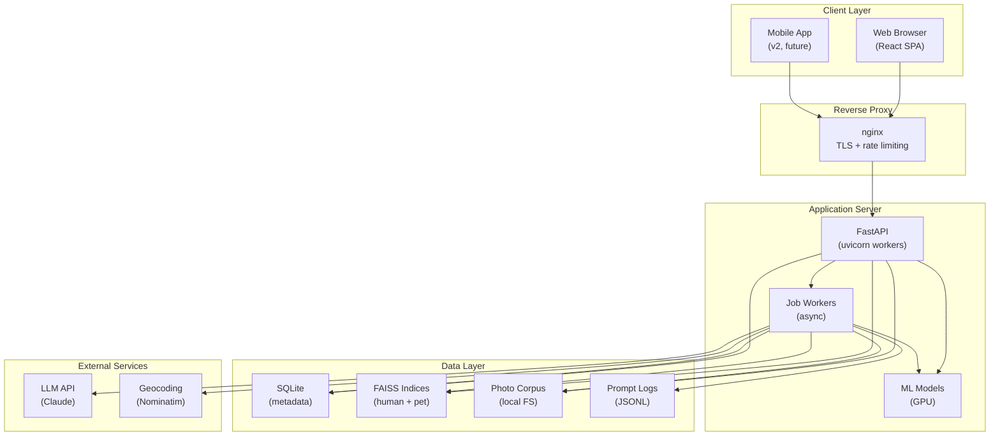

# Design Specification — Dossier v2: The Needle in a Haystack

**Version**: 1.0
**Date**: 2026-03-06
**Status**: Draft
**Architecture**: `docs/architecture/architecture_overview.md`
**Requirements**: `docs/requirements/project_requirements_v2.md`

---

## 1. Module Responsibilities

### 1.1 Module Map

| Module | Responsibility | Key Classes/Functions |
|--------|---------------|----------------------|
| `src/ingest/scanner.py` | Recursive corpus directory scanning | `CorpusScanner`, `ImageFile` |
| `src/ingest/metadata.py` | EXIF extraction from images | `MetadataExtractor`, `ImageMetadata` |
| `src/ingest/geocoder.py` | Reverse geocoding GPS to location | `Geocoder`, `LocationInfo` |
| `src/ingest/store.py` | SQLite metadata persistence | `MetadataStore` |
| `src/embeddings/base.py` | Abstract protocols for detection/embedding | `FaceDetector`, `FaceEmbedder`, `DetectedFace`, `FaceEmbedding` |
| `src/embeddings/human_detector.py` | Human face detection via InsightFace | `InsightFaceDetector` |
| `src/embeddings/human_embedder.py` | Human face embedding via ArcFace | `ArcFaceEmbedder` |
| `src/embeddings/pet_detector.py` | Pet face detection via YOLOv8 | `PetFaceDetector` |
| `src/embeddings/pet_embedder.py` | Pet embedding via DINOv2 | `PetEmbedder` |
| `src/embeddings/pipeline.py` | Unified detection + embedding pipeline | `EmbeddingPipeline` |
| `src/index/manager.py` | FAISS index lifecycle management | `IndexManager` |
| `src/index/search.py` | Type-filtered nearest-neighbor search | `search_index()`, `Match` |
| `src/index/batch.py` | Batch corpus indexing orchestration | `BatchIndexer` |
| `src/retrieval/service.py` | Query orchestration (embed -> search -> enrich) | `RetrievalService` |
| `src/narrative/timeline.py` | Chronological ordering and day grouping | `TimelineBuilder`, `Timeline`, `TimelineEntry` |
| `src/narrative/grouping.py` | Scene clustering and day segmentation | `group_by_day()`, `cluster_scenes()` |
| `src/narrative/patterns.py` | Cross-day pattern detection | `detect_patterns()`, `Pattern` |
| `src/narrative/describer.py` | VLM-based photo description | `PhotoDescriber` |
| `src/narrative/generator.py` | LLM-based dossier narrative | `DossierGenerator`, `Dossier` |
| `src/evaluation/manifest.py` | Ground-truth manifest loading | `load_manifest()`, `SubjectManifest` |
| `src/evaluation/runner.py` | Evaluation metric computation | `EvaluationRunner`, `EvaluationReport` |
| `src/jobs/manager.py` | Async job queue and lifecycle | `JobManager`, `Job` |
| `src/api/routes.py` | API endpoint definitions | FastAPI routers |
| `src/api/schemas.py` | Request/response pydantic models | API contract models |
| `src/api/deps.py` | Dependency injection | Auth, services, config |

---

## 2. Data Models

### 2.1 Core Domain Models

```python
from __future__ import annotations

import enum
from datetime import datetime
from pydantic import BaseModel
import numpy as np


class SubjectType(enum.StrEnum):
    HUMAN = "human"
    PET = "pet"


class ImageFile(BaseModel):
    path: str
    format: str  # jpeg, png, heic
    size_bytes: int
    discovered_at: datetime


class ImageMetadata(BaseModel):
    image_id: str
    timestamp: datetime | None
    latitude: float | None
    longitude: float | None
    orientation: int | None
    camera_make: str | None
    camera_model: str | None
    has_gps: bool
    has_timestamp: bool


class LocationInfo(BaseModel):
    neighborhood: str | None
    city: str | None
    state: str | None
    country: str | None
    venue_type: str | None
    display_name: str  # formatted string for UI


class BoundingBox(BaseModel):
    x: float
    y: float
    width: float
    height: float


class DetectedFace(BaseModel):
    bbox: BoundingBox
    confidence: float
    subject_type: SubjectType
    landmarks: list[tuple[float, float]] | None = None

    class Config:
        arbitrary_types_allowed = True


class FaceEmbedding(BaseModel):
    vector: list[float]  # serializable; convert from numpy at boundary
    model_name: str
    model_version: str
    dimensions: int

    class Config:
        arbitrary_types_allowed = True


class FaceRecord(BaseModel):
    face_id: str
    image_id: str
    subject_type: SubjectType
    bbox: BoundingBox
    confidence: float
    embedding_id: int  # FAISS internal ID


class Match(BaseModel):
    face_id: str
    image_id: str
    image_path: str
    image_url: str
    similarity_score: float
    subject_type: SubjectType
    bbox: BoundingBox
    metadata: ImageMetadata | None = None
    location: LocationInfo | None = None
```

### 2.2 Timeline Models

```python
class TimelineEntry(BaseModel):
    image_id: str
    image_url: str
    timestamp: datetime | None
    date: str | None  # ISO date string
    time: str | None  # HH:MM display string
    location: LocationInfo | None
    confidence: float
    scene_label: str | None  # "morning", "afternoon", etc.


class DayGroup(BaseModel):
    date: str  # ISO date
    day_label: str  # "Monday, March 3, 2026"
    entries: list[TimelineEntry]
    scenes: list[Scene]


class Scene(BaseModel):
    start_time: str | None
    end_time: str | None
    location: LocationInfo | None
    entries: list[TimelineEntry]
    label: str  # "Morning at home", "Afternoon at park"


class Timeline(BaseModel):
    subject_type: SubjectType
    date_range_start: str | None
    date_range_end: str | None
    total_days_spanned: int
    active_days: int
    days: list[DayGroup]
    gaps: list[DateGap]


class DateGap(BaseModel):
    start_date: str
    end_date: str
    gap_days: int


class Pattern(BaseModel):
    pattern_type: str  # "recurring_location", "daily_routine", "weekly_pattern"
    description: str
    confidence: float
    evidence: list[str]  # references to timeline entries
```

### 2.3 Dossier Models

```python
class DossierEntry(BaseModel):
    time: str | None
    location: str | None
    description: str
    image_url: str
    confidence: float  # 0.0 to 1.0
    confidence_label: str  # "high", "medium", "low"


class DossierDay(BaseModel):
    date: str
    day_label: str
    day_summary: str
    entries: list[DossierEntry]


class Dossier(BaseModel):
    session_id: str
    subject_type: SubjectType
    executive_summary: str
    date_range: str  # "March 1-5, 2026"
    total_photos: int
    total_days: int
    days: list[DossierDay]
    patterns: list[Pattern]
    confidence_notes: list[str]
    generated_at: datetime
```

### 2.4 Evaluation Models

```python
class SubjectManifest(BaseModel):
    subject_id: str
    name: str
    subject_type: SubjectType
    reference_photo: str  # filename
    photos: list[str]  # list of filenames


class SubjectEvaluation(BaseModel):
    subject_id: str
    subject_type: SubjectType
    total_ground_truth: int
    retrieved_count: int
    true_positives: int
    false_positives: int
    false_negatives: int
    precision: float
    recall: float
    f1: float
    false_positive_images: list[str]
    false_negative_images: list[str]


class EvaluationReport(BaseModel):
    total_subjects: int
    human_subjects: int
    pet_subjects: int
    aggregate_precision: float
    aggregate_recall: float
    aggregate_f1: float
    human_precision: float
    human_recall: float
    human_f1: float
    pet_precision: float
    pet_recall: float
    pet_f1: float
    per_subject: list[SubjectEvaluation]
    cross_type_confusions: int
    evaluated_at: datetime
```

### 2.5 Job Models

```python
class JobStatus(enum.StrEnum):
    PENDING = "pending"
    RUNNING = "running"
    COMPLETED = "completed"
    FAILED = "failed"
    CANCELLED = "cancelled"


class JobType(enum.StrEnum):
    INDEX = "index"
    QUERY = "query"
    DOSSIER = "dossier"
    EVALUATE = "evaluate"


class Job(BaseModel):
    id: str
    type: JobType
    status: JobStatus
    progress: float  # 0.0 to 1.0
    message: str | None  # human-readable status
    result: dict | None  # job-specific result data
    error: str | None
    created_at: datetime
    updated_at: datetime
    completed_at: datetime | None
```

---

## 3. API Contract

### 3.1 Endpoints

All endpoints are prefixed with `/api/v1`. Responses follow the JSON envelope:

**Success**: `{ "data": ... }` or direct model.
**Error**: `{ "error": { "code": "VALIDATION_ERROR", "message": "...", "details": {...} } }`

#### Detection

```
POST /api/v1/detect
Content-Type: multipart/form-data

Request:
  - file: image file (JPEG, PNG, HEIC)

Response 200:
  {
    "image_width": 1920,
    "image_height": 1080,
    "faces": [
      {
        "bbox": {"x": 120, "y": 80, "width": 200, "height": 250},
        "confidence": 0.97,
        "subject_type": "human"
      },
      {
        "bbox": {"x": 800, "y": 300, "width": 150, "height": 180},
        "confidence": 0.91,
        "subject_type": "pet"
      }
    ]
  }
```

#### Query

```
POST /api/v1/query
Content-Type: multipart/form-data

Request:
  - file: image file
  - subject_type: "human" | "pet"
  - face_bbox: JSON string (optional) {"x": 120, "y": 80, "width": 200, "height": 250}
  - threshold: float (optional, default from settings)
  - top_k: int (optional, default from settings)
  - date_from: ISO date string (optional)
  - date_to: ISO date string (optional)

Response 200 (sync, small corpus):
  {
    "session_id": "qs_abc123",
    "total_results": 15,
    "results": [ ...Match objects... ]
  }

Response 202 (async, large corpus):
  {
    "job_id": "job_xyz789",
    "status": "pending",
    "poll_url": "/api/v1/jobs/job_xyz789"
  }
```

#### Query Results (Paginated)

```
GET /api/v1/query/{session_id}/results?cursor=xxx&limit=20

Response 200:
  {
    "session_id": "qs_abc123",
    "results": [ ...Match objects... ],
    "next_cursor": "eyJ...",
    "has_more": true
  }
```

#### Dossier

```
POST /api/v1/dossier
Content-Type: application/json

Request:
  {
    "session_id": "qs_abc123",
    "subject_type": "human"
  }

Response 202:
  {
    "job_id": "job_dos456",
    "status": "pending",
    "poll_url": "/api/v1/jobs/job_dos456"
  }
```

```
GET /api/v1/dossier/{session_id}?format=json

Response 200:
  { ...Dossier object... }
```

#### Evaluation

```
POST /api/v1/evaluate
Content-Type: multipart/form-data

Request:
  - file: reference photo
  - subject_id: string
  - subject_type: "human" | "pet"

Response 200:
  { ...SubjectEvaluation object... }
```

```
GET /api/v1/evaluate/summary

Response 200:
  { ...EvaluationReport object... }
```

#### Jobs

```
GET /api/v1/jobs/{job_id}

Response 200:
  { ...Job object... }
```

```
GET /api/v1/jobs/{job_id}/stream
Accept: text/event-stream

SSE Events:
  data: {"status": "running", "progress": 0.45, "message": "Processing image 450/1000"}
  data: {"status": "completed", "progress": 1.0, "result": {...}}
```

#### Media

```
GET /api/v1/media/{path}?size=thumb

Response 200:
  Content-Type: image/jpeg
  (binary image data)
```

#### Upload

```
POST /api/v1/photos/upload
Content-Type: multipart/form-data

Request:
  - files: one or more image files
  - metadata: JSON string (optional) [{"filename": "...", "timestamp": "...", "lat": ..., "lng": ...}]

Response 200:
  {
    "uploaded": [
      {"photo_id": "ph_001", "filename": "IMG_001.jpg", "metadata": {...}}
    ]
  }
```

```
POST /api/v1/photos/upload/init
Content-Type: application/json

Request:
  {
    "filename": "large_photo.jpg",
    "size_bytes": 15000000,
    "content_type": "image/jpeg"
  }

Response 200:
  {
    "session_id": "up_abc123",
    "chunk_size": 1048576
  }
```

```
PATCH /api/v1/photos/upload/{session_id}
Content-Range: bytes 0-1048575/15000000
Content-Type: application/octet-stream

(binary chunk data)

Response 200:
  {
    "session_id": "up_abc123",
    "bytes_received": 1048576,
    "bytes_total": 15000000,
    "complete": false
  }
```

#### Index Stats

```
GET /api/v1/index/stats

Response 200:
  {
    "total_images": 1023456,
    "total_faces": 1456789,
    "human_faces": 1200000,
    "pet_faces": 256789,
    "index_size_mb": 2048,
    "last_indexed_at": "2026-03-05T14:30:00Z"
  }
```

#### Health

```
GET /health

Response 200:
  {
    "status": "healthy",
    "ready": true,
    "components": {
      "api": "up",
      "index": "loaded",
      "models": "ready",
      "metadata_db": "connected"
    },
    "version": "0.1.0",
    "uptime_seconds": 3600
  }
```

---

## 4. Interface Contracts (Python)

### 4.1 Face Detection Protocol

```python
from typing import Protocol

class FaceDetector(Protocol):
    """Detects faces in an image and returns bounding boxes with confidence."""

    def detect(self, image: np.ndarray) -> list[DetectedFace]:
        """
        Args:
            image: RGB image as numpy array (H, W, 3).

        Returns:
            List of detected faces with bounding boxes, confidence, and subject type.
            Empty list if no faces detected.
        """
        ...

    @property
    def subject_type(self) -> SubjectType:
        """The type of subject this detector handles."""
        ...
```

### 4.2 Face Embedding Protocol

```python
class FaceEmbedder(Protocol):
    """Computes identity/similarity embeddings for detected faces."""

    def embed(self, face_image: np.ndarray) -> FaceEmbedding:
        """
        Args:
            face_image: Aligned face crop as numpy array (H, W, 3).

        Returns:
            Normalized embedding vector with model metadata.
        """
        ...

    @property
    def dimensions(self) -> int:
        """Dimensionality of the output embedding vector."""
        ...

    @property
    def subject_type(self) -> SubjectType:
        """The type of subject this embedder handles."""
        ...
```

### 4.3 Index Manager Interface

```python
class IndexManager:
    """Manages FAISS indices for human and pet face embeddings."""

    def add(self, embeddings: np.ndarray, face_ids: list[str],
            subject_type: SubjectType) -> None:
        """Add embeddings to the type-specific index."""
        ...

    def search(self, query: np.ndarray, k: int, threshold: float,
               subject_type: SubjectType) -> list[Match]:
        """Search the type-filtered index for nearest neighbors."""
        ...

    def save(self, path: str) -> None:
        """Persist indices to disk."""
        ...

    def load(self, path: str) -> None:
        """Load indices from disk."""
        ...

    def stats(self) -> dict:
        """Return index statistics."""
        ...
```

### 4.4 Narrative Service Interface

```python
class PhotoDescriber:
    """Describes photo content using a vision-language model."""

    def describe(self, image: np.ndarray, metadata: ImageMetadata,
                 subject_type: SubjectType) -> str:
        """
        Generate a natural-language description of the photo.

        Args:
            image: Full image as numpy array.
            metadata: EXIF and location metadata.
            subject_type: Whether to focus on human or pet subject.

        Returns:
            Text description of the photo content.
        """
        ...


class DossierGenerator:
    """Generates timeline narrative from photo descriptions."""

    def generate(self, descriptions: list[str], timeline: Timeline,
                 patterns: list[Pattern], subject_type: SubjectType) -> Dossier:
        """
        Generate a structured dossier from ordered photo descriptions.

        Args:
            descriptions: VLM-generated description for each photo.
            timeline: Chronologically ordered timeline with day groups.
            patterns: Detected cross-day patterns.
            subject_type: Human or pet (affects narrative voice).

        Returns:
            Structured dossier with executive summary, per-day entries, and patterns.
        """
        ...
```

---

## 5. Error Handling Strategy

### 5.1 Error Code Extensions

Extend the existing `ErrorCode` enum for Dossier-specific errors:

```python
class ErrorCode(StrEnum):
    # ... existing codes ...

    # Detection
    NO_FACE_DETECTED = "NO_FACE_DETECTED"
    UNSUPPORTED_IMAGE_FORMAT = "UNSUPPORTED_IMAGE_FORMAT"
    IMAGE_TOO_LARGE = "IMAGE_TOO_LARGE"

    # Index
    INDEX_NOT_LOADED = "INDEX_NOT_LOADED"
    INDEX_BUILD_FAILED = "INDEX_BUILD_FAILED"

    # Retrieval
    SESSION_NOT_FOUND = "SESSION_NOT_FOUND"
    SESSION_EXPIRED = "SESSION_EXPIRED"

    # Narrative
    VLM_UNAVAILABLE = "VLM_UNAVAILABLE"
    LLM_UNAVAILABLE = "LLM_UNAVAILABLE"
    DOSSIER_GENERATION_FAILED = "DOSSIER_GENERATION_FAILED"

    # Evaluation
    MANIFEST_INVALID = "MANIFEST_INVALID"
    SUBJECT_NOT_FOUND = "SUBJECT_NOT_FOUND"

    # Jobs
    JOB_NOT_FOUND = "JOB_NOT_FOUND"
    JOB_TIMEOUT = "JOB_TIMEOUT"

    # Upload
    UPLOAD_SESSION_NOT_FOUND = "UPLOAD_SESSION_NOT_FOUND"
    UPLOAD_CHUNK_INVALID = "UPLOAD_CHUNK_INVALID"
    UPLOAD_SIZE_EXCEEDED = "UPLOAD_SIZE_EXCEEDED"
```

### 5.2 Graceful Degradation Cascade

Each pipeline stage has defined fallback behavior:

| Stage | Failure | Fallback |
|-------|---------|----------|
| EXIF extraction | Corrupt/missing EXIF | Proceed with `None` metadata fields; log warning |
| Reverse geocoding | Service unavailable or rate limited | Use raw GPS coordinates; cache results for retry |
| Human face detection | Model load failure | Return `INDEX_NOT_LOADED` error; system partially available (pet queries still work) |
| Pet face detection | Model load failure | Return `INDEX_NOT_LOADED` error; system partially available (human queries still work) |
| VLM photo description | Model unavailable or timeout | Fall back to metadata-only description: "Photo taken at {time} at {location}" |
| LLM dossier generation | API error or timeout | Return partial dossier with photo descriptions and timeline but no narrative prose |
| FAISS search | Index corrupted | Return `INDEX_BUILD_FAILED`; trigger re-index alert |
| Reverse proxy | Backend down | nginx returns 502; web SPA shows "Backend unavailable" message |

### 5.3 Timeout Budget

| Operation | Timeout | Notes |
|-----------|---------|-------|
| Face detection (single image) | 5 seconds | Covers both human + pet detectors |
| Face embedding (single face) | 2 seconds | Per face crop |
| FAISS search | 1 second | Should be sub-second even at 1M scale |
| VLM photo description | 30 seconds | Per photo; includes model inference |
| LLM dossier generation | 120 seconds | For full multi-day narrative |
| Reverse geocoding | 5 seconds | Per GPS coordinate, with cache |
| Total query pipeline (sync) | 10 seconds | Detection + embedding + search + metadata enrichment |
| Total dossier pipeline | 5 minutes | All photos described + narrative generated |

---

## 6. Non-Functional Constraint Mapping

### 6.1 Performance Budgets

| Metric | Target | Measurement |
|--------|--------|-------------|
| Query latency (p50) | < 2 seconds | Time from query submission to first results |
| Query latency (p95) | < 5 seconds | Including metadata enrichment |
| Dossier generation (10 photos) | < 30 seconds | End-to-end including VLM + LLM |
| Indexing throughput | > 100 images/second | On GPU, including detection + embedding |
| Media serving | < 100ms | Static file serving via nginx |
| API cold start | < 30 seconds | Model loading + index loading |

### 6.2 Reliability Targets

| Target | Value | Implementation |
|--------|-------|----------------|
| API availability | 99.5% (single node) | Health checks, auto-restart |
| Index data durability | No data loss on restart | Persist to disk after each batch |
| Job completion | 99% of submitted jobs complete | Timeout + retry + error reporting |
| Graceful degradation | Partial service on model failure | Independent model loading per type |

### 6.3 Security Controls

| Control | Implementation | Requirement |
|---------|---------------|-------------|
| Authentication | JWT tokens (stateless) | REQ-SEC-004 |
| Admin auth | X-Admin-Secret header | Existing pattern |
| Input validation | File type + size + magic bytes | REQ-SEC-002 |
| Path traversal prevention | Validate paths within corpus_dir | REQ-SEC-004 |
| Prompt injection defense | System prompt isolation, output validation | REQ-SEC-003 |
| Rate limiting | Per-IP request throttling | REQ-SEC-007 |
| Secret management | Env vars only, never YAML/git | REQ-SEC-001, REQ-CFG-007 |
| Large file prevention | .gitignore for models, indices, corpus | REQ-SEC-009 |

### 6.4 Observability Requirements

| Signal | Implementation | Requirement |
|--------|---------------|-------------|
| Structured logs | structlog JSON with AI fields | REQ-LOG-001..003 |
| Prompt logging | Dedicated JSONL store with redaction | REQ-LOG-004..006 |
| Request correlation | UUID per request, propagated through pipeline | REQ-LOG-002 |
| Health endpoint | /health with liveness + readiness | REQ-RUN-011 |
| Index stats | /index/stats endpoint | REQ-OBS-002 |
| Model performance | Per-query precision/recall logging | REQ-OBS-019..026 |
| Latency tracking | p50/p95/p99 per pipeline stage | REQ-OBS-021 |

---

## 7. Database Schema

### 7.1 SQLite Schema

```sql
-- Images table: one row per corpus image
CREATE TABLE images (
    id TEXT PRIMARY KEY,              -- UUID
    path TEXT NOT NULL UNIQUE,        -- relative path within corpus_dir
    format TEXT NOT NULL,             -- jpeg, png, heic
    size_bytes INTEGER NOT NULL,
    indexed_at TEXT NOT NULL,          -- ISO 8601 timestamp
    status TEXT NOT NULL DEFAULT 'indexed'  -- indexed, failed, skipped
);

-- Image metadata: EXIF and derived data
CREATE TABLE metadata (
    image_id TEXT PRIMARY KEY REFERENCES images(id),
    timestamp TEXT,                    -- ISO 8601 original capture time
    latitude REAL,                    -- decimal degrees
    longitude REAL,                   -- decimal degrees
    orientation INTEGER,
    camera_make TEXT,
    camera_model TEXT,
    timezone TEXT,                    -- derived from GPS
    location_name TEXT,              -- reverse-geocoded display name
    location_neighborhood TEXT,
    location_city TEXT,
    location_country TEXT
);

-- Face records: one row per detected face
CREATE TABLE faces (
    id TEXT PRIMARY KEY,              -- UUID
    image_id TEXT NOT NULL REFERENCES images(id),
    subject_type TEXT NOT NULL,        -- 'human' or 'pet'
    bbox_x REAL NOT NULL,
    bbox_y REAL NOT NULL,
    bbox_w REAL NOT NULL,
    bbox_h REAL NOT NULL,
    confidence REAL NOT NULL,
    embedding_index_id INTEGER,       -- FAISS internal ID
    model_name TEXT NOT NULL,         -- e.g., 'arcface', 'dinov2'
    created_at TEXT NOT NULL
);

-- Query sessions: track retrieval results
CREATE TABLE query_sessions (
    id TEXT PRIMARY KEY,              -- session_id
    reference_image_path TEXT,
    subject_type TEXT NOT NULL,
    threshold REAL NOT NULL,
    top_k INTEGER NOT NULL,
    total_results INTEGER,
    created_at TEXT NOT NULL,
    expires_at TEXT NOT NULL
);

-- Query results: matches for a session
CREATE TABLE query_results (
    session_id TEXT NOT NULL REFERENCES query_sessions(id),
    rank INTEGER NOT NULL,
    face_id TEXT NOT NULL REFERENCES faces(id),
    similarity_score REAL NOT NULL,
    PRIMARY KEY (session_id, rank)
);

-- Jobs: async job tracking
CREATE TABLE jobs (
    id TEXT PRIMARY KEY,
    type TEXT NOT NULL,                -- 'index', 'query', 'dossier', 'evaluate'
    status TEXT NOT NULL DEFAULT 'pending',
    progress REAL NOT NULL DEFAULT 0.0,
    message TEXT,
    result_json TEXT,                 -- JSON blob
    error TEXT,
    created_at TEXT NOT NULL,
    updated_at TEXT NOT NULL,
    completed_at TEXT
);

-- Dossiers: generated narratives
CREATE TABLE dossiers (
    session_id TEXT PRIMARY KEY REFERENCES query_sessions(id),
    subject_type TEXT NOT NULL,
    dossier_json TEXT NOT NULL,        -- full Dossier model as JSON
    generated_at TEXT NOT NULL
);

-- Evaluation results
CREATE TABLE evaluations (
    subject_id TEXT NOT NULL,
    subject_type TEXT NOT NULL,
    precision REAL NOT NULL,
    recall_score REAL NOT NULL,
    f1 REAL NOT NULL,
    true_positives INTEGER NOT NULL,
    false_positives INTEGER NOT NULL,
    false_negatives INTEGER NOT NULL,
    details_json TEXT,                -- false positive/negative image lists
    evaluated_at TEXT NOT NULL,
    PRIMARY KEY (subject_id, evaluated_at)
);

-- Indices
CREATE INDEX idx_faces_image ON faces(image_id);
CREATE INDEX idx_faces_type ON faces(subject_type);
CREATE INDEX idx_metadata_timestamp ON metadata(timestamp);
CREATE INDEX idx_metadata_location ON metadata(latitude, longitude);
CREATE INDEX idx_query_results_session ON query_results(session_id);
CREATE INDEX idx_jobs_status ON jobs(status);
```

### 7.2 Prompt Log Schema (JSONL)

Each line is a JSON object:

```json
{
  "timestamp": "2026-03-06T10:30:00Z",
  "request_id": "req_abc123",
  "model": "qwen-2.5-vl-72b",
  "model_type": "vlm",
  "operation": "photo_description",
  "prompt_hash": "sha256:...",
  "prompt_length_chars": 450,
  "response_length_chars": 200,
  "input_tokens": 120,
  "output_tokens": 80,
  "latency_ms": 2500,
  "temperature": 0.3,
  "max_tokens": 500,
  "status": "success",
  "subject_type": "human",
  "image_id": "img_xyz"
}
```

Full prompt/response text logged only at DEBUG level. At INFO, only metadata (above) is logged.

---

## 8. Configuration Schema

### 8.1 New Settings Classes

```python
class CorpusSettings(BaseModel):
    corpus_dir: str = "data/corpus"
    supported_formats: list[str] = ["jpg", "jpeg", "png", "heic", "heif"]
    max_image_size_mb: int = 50


class DetectionSettings(BaseModel):
    human_model: str = "insightface"       # insightface | mock
    pet_model: str = "yolov8"              # yolov8 | dinov2 | mock
    min_face_confidence: float = 0.5
    min_pet_confidence: float = 0.4
    device: str = "auto"                   # auto | cpu | cuda


class IndexSettings(BaseModel):
    faiss_index_dir: str = "data/indices"
    human_index_file: str = "human.index"
    pet_index_file: str = "pet.index"
    metadata_db_path: str = "data/metadata.db"
    human_similarity_threshold: float = 0.6
    pet_similarity_threshold: float = 0.5
    default_top_k: int = 50
    index_type: str = "flat"               # flat | ivf
    ivf_nlist: int = 100                   # for IVF index


class NarrativeSettings(BaseModel):
    vlm_model: str = "qwen-2.5-vl"
    vlm_endpoint: str = ""                 # empty = local inference
    llm_model: str = "claude"
    llm_endpoint: str = ""                 # empty = use anthropic SDK
    llm_api_key: str = ""                  # MUST come from env var, never YAML
    vlm_max_tokens: int = 500
    llm_max_tokens: int = 4000
    temperature: float = 0.3


class JobSettings(BaseModel):
    max_concurrent_jobs: int = 4
    job_timeout_seconds: int = 600
    result_ttl_seconds: int = 3600


class UploadSettings(BaseModel):
    max_file_size_mb: int = 20
    chunk_size_bytes: int = 1048576        # 1MB
    upload_dir: str = "data/uploads"
    accepted_types: list[str] = ["image/jpeg", "image/png", "image/heic"]
```

### 8.2 Environment Variable Mapping

| Env Var | Settings Path | Notes |
|---------|--------------|-------|
| `CORPUS__DIR` | `settings.corpus.corpus_dir` | Path to photo corpus |
| `DETECTION__HUMAN_MODEL` | `settings.detection.human_model` | insightface / mock |
| `DETECTION__PET_MODEL` | `settings.detection.pet_model` | yolov8 / mock |
| `DETECTION__DEVICE` | `settings.detection.device` | auto / cpu / cuda |
| `INDEX__FAISS_INDEX_DIR` | `settings.index.faiss_index_dir` | Index storage path |
| `INDEX__HUMAN_SIMILARITY_THRESHOLD` | `settings.index.human_similarity_threshold` | 0.0-1.0 |
| `INDEX__PET_SIMILARITY_THRESHOLD` | `settings.index.pet_similarity_threshold` | 0.0-1.0 |
| `INDEX__DEFAULT_TOP_K` | `settings.index.default_top_k` | Integer |
| `NARRATIVE__LLM_API_KEY` | `settings.narrative.llm_api_key` | Env-only, never YAML |
| `NARRATIVE__LLM_MODEL` | `settings.narrative.llm_model` | claude / qwen / llama |
| `NARRATIVE__VLM_MODEL` | `settings.narrative.vlm_model` | qwen-2.5-vl / llava |
| `JOBS__MAX_CONCURRENT` | `settings.jobs.max_concurrent_jobs` | Integer |
| `UPLOAD__MAX_FILE_SIZE_MB` | `settings.upload.max_file_size_mb` | Integer |

---

## 9. LLM / Agent Specifics

### 9.1 Models Used

| Model | Purpose | Input | Output | Max Tokens |
|-------|---------|-------|--------|------------|
| Qwen-2.5-VL (72B or 7B) | Photo description | Image + metadata prompt | Text description | 500 |
| Claude Opus / Sonnet | Dossier narrative | Structured descriptions + timeline | Dossier JSON | 4000 |
| Qwen-2.5 (alternative) | Dossier narrative (local) | Same as Claude | Same | 4000 |
| Llama (alternative) | Dossier narrative (local) | Same as Claude | Same | 4000 |

### 9.2 Prompting Strategy

**Photo Description (VLM)**:

```
System: You are a forensic photo analyst. Describe what you see in this photo
focusing on the {subject_type} subject. Include: setting/environment,
activity, clothing/appearance (human) or posture/behavior (pet), other people
or animals present, and any notable objects.

Context: This photo was taken at {time} at {location}.

Describe what you observe. Be factual — describe only what is visible.
Do not speculate about identity or intent.
```

**Dossier Generation (LLM)**:

```
System: You are an intelligence analyst writing a surveillance dossier.
Given a series of photo descriptions with timestamps and locations,
produce a structured timeline narrative for a {subject_type}.

Rules:
- Structure the narrative by day
- Connect events logically across time and location
- Note patterns and routines
- Use uncertainty language ("appears to", "likely") when confidence is low
- For pets, use appropriate language (e.g., "the dog was observed at")
- Flag any anomalies (impossible travel times, conflicting metadata)
- Include an executive summary covering the full observation period

Output format: JSON matching the Dossier schema.
```

### 9.3 Safety Policies

| Policy | Implementation |
|--------|---------------|
| No identity claims | System prompt instructs: "Do not speculate about identity or intent" |
| PII redaction | Output validation scans for names, addresses, phone numbers |
| Prompt injection isolation | System prompt is fixed; user input never concatenated with system prompt |
| Harmful content check | Output validation rejects narratives with harmful language |
| Factual grounding | "Describe only what is visible" — no speculation beyond photo content |

---

## 10. Validation / Open Issues

| Item | Type | Status | Notes |
|------|------|--------|-------|
| Pet detection model accuracy | Technical | Open | Need to benchmark YOLOv8 fine-tuned vs. general detection on pet dataset |
| VLM local vs. API deployment | Decision | Open | GPU memory budget determines if VLM runs locally or via API |
| LLM structured output reliability | Technical | Open | Claude JSON mode vs. Qwen instruction-following for Dossier schema compliance |
| HEIC support across platforms | Technical | Open | Need to test pillow-heif on Linux and macOS |
| Multi-worker GPU model sharing | Technical | Open | Single worker with async or multiple workers with shared GPU memory |
| Batch size optimization for indexing | Performance | Open | Need to profile detection + embedding throughput vs. GPU memory |
| SQLite WAL mode under concurrent load | Reliability | Low risk | Well-documented for read-heavy workloads; writes are infrequent |
| Cursor pagination implementation | Technical | Open | Need to decide cursor encoding (opaque base64 vs. timestamp-based) |

---

## 11. Diagrams

### 11.1 Sequence Diagram — Query Flow



### 11.2 Sequence Diagram — Dossier Generation



### 11.3 Deployment Diagram


